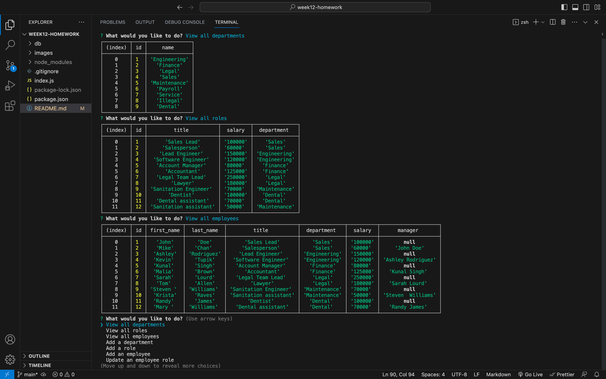

# SQL Employee Tracker

## Description

AS A business owner
I WANT to be able to view and manage the departments, roles, and employees in my company
SO THAT I can organize and plan my business

GIVEN a command-line application that accepts user input
WHEN I start the application
THEN I am presented with the following options: view all departments, view all roles, view all
employees, add a department, add a role, add an employee, and update an employee role

WHEN I choose to view all departments
THEN I am presented with a formatted table showing department names and department ids

WHEN I choose to view all roles
THEN I am presented with the job title, role id, the department that role belongs to, and the salary for that role

WHEN I choose to view all employees
THEN I am presented with a formatted table showing employee data, including employee ids, first names, last names, job titles, departments, salaries, and managers that the employees report to

WHEN I choose to add a department
THEN I am prompted to enter the name of the department and that department is added to the database

WHEN I choose to add a role
THEN I am prompted to enter the name, salary, and department for the role and that role is added to the database

WHEN I choose to add an employee
THEN I am prompted to enter the employee’s first name, last name, role, and manager, and that employee is added to the database

WHEN I choose to update an employee role
THEN I am prompted to select an employee to update and their new role and this information is updated in the database

This was able to be achieved by calling a function that uses inquirer to accept user input and based off the list selection provide that data will meet the requirements of individual if statements that perform SQL code based off of additional user input. Through the continued use of else if statements the following criteria was also achieved:

- Application allows users to update employee managers.

- Application allows users to view employees by manager.

- Application allows users to view employees by department.

- Application allows users to delete departments.

- Application allows users to delete roles.

- Application allows users to delete employee's.

## Table of Contents

- [Installation](#installation)

- [Usage](#usage)

- [Questions](#questions)

## Installation

- Step 1: The user will need to have [Node.js](https://nodejs.org/en/download) installed on their PC or use the link provided to install it.

- Step 2: Install mysql on your PC through the Homebrew package manager by typing 'brew install mysql' into your terminal. Additional instructions can be found by following this [link](https://coding-boot-camp.github.io/full-stack/mysql/mysql-installation-guide).

- Step 3: Before running the program the user will need to install the inquirer package 8.2.4 and mysql2 package by typing 'npm install inquirer@8.2.4' & 'npm install --save mysql2' into the terminal integrated to the location of the folder holding the program.

- Step 4: Using mysql run the schema.sql and seeds.sql files by typing 'source db/schema.sql' and then 'source seeds.sql' into mysql.

- Step 5: The user will run the program by following the example provided in the [Usage](#usage) section.

## Usage

Video Example: https://watch.screencastify.com/v/94JgO6T7R5YCo0DM4syC

## Questions

Regarding any questions please check out my Github profile [JakeHowdeshell](https://github.com/JakeHowdeshell/node.js-readme-generator/tree/main).

Or send me an [email](mailto:Jakehowdy@gmail.com).